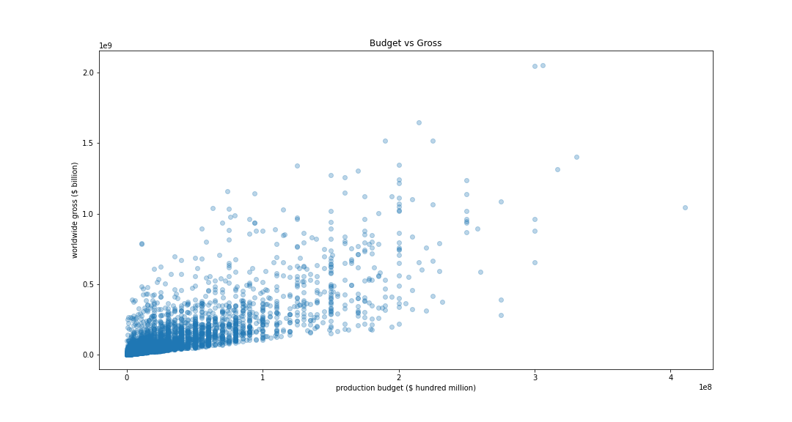
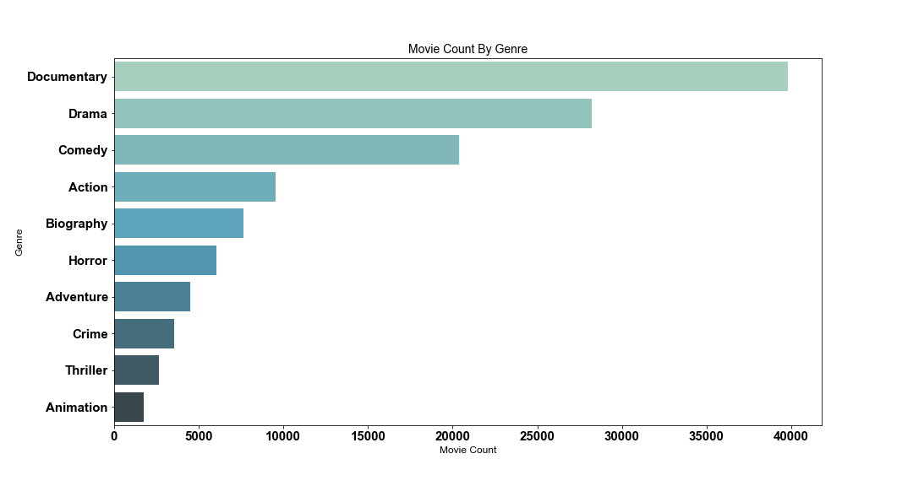
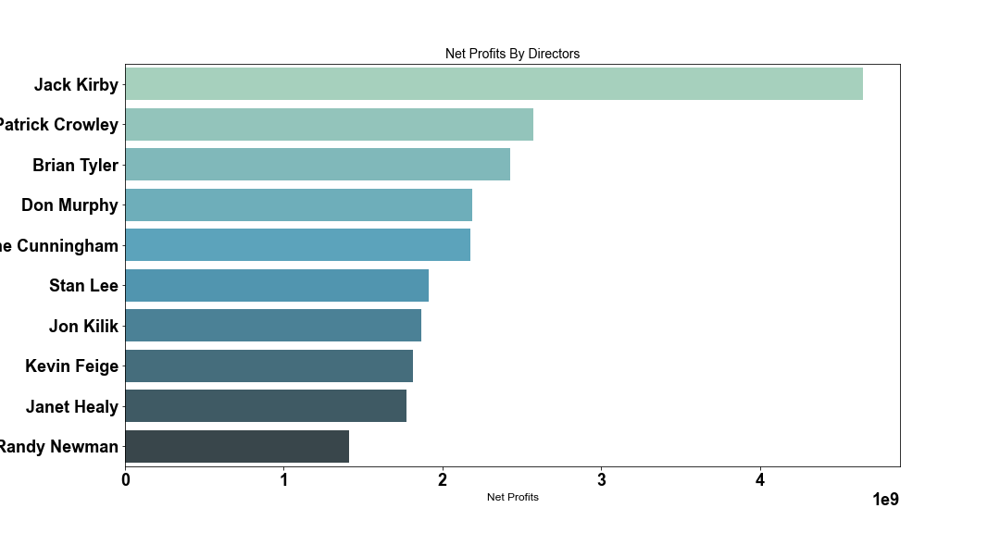

# Microsoft Movie Analysis

**Authors**: Kyunghwan William Kim 

## Overview

Microsoft announced that they will create a new movie studio and have requested the analysis of the current film industry. The main objective is to investigate the movie industry to gain sufficient understanding of what attributes to success and in turn utilize this analysis to create actionable recommendations.

## Business Problem

Microsoft has announced that they will create a new movie studio however, they have no prior knowledge of the movie industry, and they need help so that their movie studio can be successful. 
The goal is to provide Microsoft with a data-driven analysis of the movie industry and determine the factors of a successful movie. 

***
The following factors of a successful movie were investigated:
	1. What are the most profitable movies and how are the production budgets related?
	2. Which movie studios are some of the biggest competitors?
	3. Which movie genres are the most popular in the movie industry
	4. Which directors tend to add the most value?
***

## Data

The data provided was collected from the following sources

***
•	Box Office Mojo
•	IMDB
•	The Numbers
***

The data found was stored as .csv files and were imported and investigated. 

***
The .csv files that were imported are the following:
•	“imdb title crew” : each record represents a director and writer (encoded)
•	“imdb title ratings” : each record represents a director’s full primary name
•	“bom movie gross” : each record represents a movie with studio and worldwide gross $
•	“imdb title basics” : each record represents a movie with genres
•	“imdb title principals” : required to join data frames together
•	“tn movie budgets” : each record represents a movie’s production budget and worldwide gross $
***

## Methods

The data frames were imported from various sources and the data sets were not aligned. In order to join the data sets together each data set was inspected and cleaned. When appropriate rows and columns containing null values were dropped. Irrelevant and duplicate data were removed as well. 
After the exploratory data analysis, the main factor related to the success of a movie was decided. By subtracting the production budget from the worldwide gross revenue, a new value was created to investigate the net profits. Additionally, the analysis was to find the most profitable movies, thus movies that made $0 in revenue were eliminated. Finally, movies that made over $200B in net profits were removed from the analysis (Titanic & Avatar)
Descriptive statistics and data visualizations were used to isolate the relevant factors of a successful movie. 


## Results

##### Question #1: What are the most profitable movies and how are the production budgets related?

Recommendation #1: We discovered that the highest grossed movies are not equal to the movies with the most profits. Meaning that pouring money into a movie does not guarantee a success in the box office. Instead, the top 25 most profitable movies were investigated, and found that the mean production budget is $182,756,000.00 and is the recommended production budget for a successful movie

### Visual 1


##### Question #2: Which movie studios are some of the biggest competitors?

Recommendation #2: Similarly, the top 5 movie studios that make the most movies are the not the same as the top 5 movie studios that made the most profits. 

***
The top 5 studios that make the most movies are
1.	Fox 		(102)
2.	Universal 	(99)
3.	Warner Bros 	(89)
4.	Sony 		(69)
5.	Paramount 	(66)

The top 5 studios that made the most profits are
1.	Buena Vista 	($23 Billion)
2.	Universal 	($21 Billion)
3.	Fox 		($19 Billion)
4.	Warner Bros 	($14 Billion)
5.	Paramount 	($12 Billion)
***

### Visual 2


##### Question #3: Which movie genres are the most popular in the movie industry

Recommendation #3: Even though the top 3 movies genres produced are Documentary, Drama, and Comedy. When profit and gross revenue is calculated, the top 3 movie genres changes significantly.  The top 3 movie genres that produce the most revenues are Action, Adventure, and Comedy. Here the movie genre Action is on top and the worldwide gross $ is double the amount of Adventure which comes in second.

##### Question #4: Which directors tend to add the most value? 

Recommendation #4: The top 10 directors that made the most profitable movies are listed. We recommend hiring a director from the list below. 


Here is an example of how to embed images from your sub-folder:

### Visual 3


## Conclusions

While there are many other factors that contribute to the success of a movie, based on this analysis the following recommendations will result in a successful business venture for Microsoft’s new movie studio.

1.	Recommend that Microsoft should budget the production around $182,000,000.00
2.	Buena Vista and Universal have been dominating the box office recently. Recommend to consider these studios as competitors and analyze their work to find out what is a competitive advantage Microsoft can have.
3.	Recommend that Microsoft focus on the top 3 profitable movie genres which are Action, Adventure and Comedy.
4.	Recommend that Microsoft hires Jack Kirby or one of the top 10 profitable directors. 

Further Analysis – For future analysis, I would like to investigate the relationship of highly rated movies and the net profit revenuess


## For More Information

Please review our full analysis in [our Jupyter Notebook](./dsc-phase1-project-template.ipynb) or our [presentation](./DS_Project_Presentation.pdf).

For any additional questions, please contact **Kyunghwan William Kim / khwilliamkim@outlook.com**

## Repository Structure

Describe the structure of your repository and its contents, for example:

```
├── README.md                           <- The top-level README for reviewers of this project
├── dsc-phase1-project-template.ipynb   <- Narrative documentation of analysis in Jupyter notebook
├── DS_Project_Presentation.pdf         <- PDF version of project presentation
├── data                                <- Both sourced externally and generated from code
└── images                              <- Both sourced externally and generated from code
```
